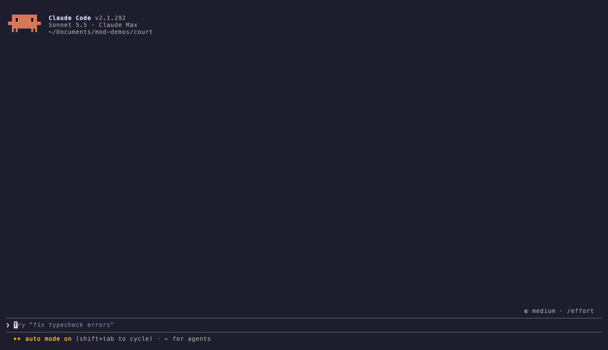

# trial-run

**Risky commands stand trial before they run.**

Your AI tried to force-push to main. It got a trial. It lost.



A Claude Code mod that puts risky shell commands on trial before they run.

## All rise

When Claude reaches for `rm -rf`, a force push or a `DROP TABLE`, court is called into session in a pane beside the transcript:

1. **The jury deliberates.** Claude Code's spinner says `Deliberating` until the verdict, then goes back to its own word. A gavel bangs, the scales of justice go up with their pans bobbing, and the case is read into the record with its number and the defendant's prior convictions on the charge. A bar counts down the seconds to the court's deadline. You can **Object** (the command is denied on the spot) or **Skip the trial** (the case is filed as `- WAIVED` and goes to your usual rules): press ctrl+x tab to reach the pane, then `o` or `s`.
2. **The prosecution** explains, in two dramatic sentences at most, what the command could destroy, typed out as it is delivered.
3. **The defense** argues that the agent needs it, citing what you and Claude actually said. It has to argue for its client, however hopeless the case.
4. **ALL RISE.** The gavel comes down, the judge rules, and the verdict drops onto the pane in very large letters, still wet with ink. The frame turns the verdict's colour, and it is read out loud.
5. **Claude hears the verdict too.** A guilty command is refused with the judge's reason and a **sentence**: one safer way to do the same job, read out under the ruling. Claude tells you the court has ruled and offers you the sentence.
6. **The verdict stays in the transcript.** The denied Bash call carries a stamp under Claude Code's own row, `✕ GUILTY · case #0017`, or `✕ CONTEMPT · case #0018` for a retry: under the folded `Ran 1 shell command` line, and under the call's result in the full transcript (ctrl+o). Every other row, an acquitted or untried command's included, is drawn as Claude Code draws it.
7. **Court adjourned.** A turn of the main conversation that held at least one trial ends with one line under Claude's answer: `Court adjourned. 1 conviction, 1 acquittal this turn.` (contempt counts as a conviction; mistrials and waivers are named when there were any). Claude Code labels the line with the plugins whose hooks drew it. A turn with no trial, an interrupted turn and a subagent's turn get none; a subagent's trials are counted in the main turn they ran in.

Claude knows the court sits before it is ever tried: the Bash tool's description ends with two sentences saying that risky commands stand trial and that stating the intent in the same message helps the defense, which quotes Claude's latest words. The notice is added once per session, to the Bash tool only, and not at all with every charge switched off.

The court is strict but not unreasonable: `rm -rf node_modules` for a clean reinstall walks free, and "force push main, don't ask questions" does not.

## Install

Requires Claude Code 2.1.287 or later (mods). Developed and tested on 2.1.292. The court is designed for a dark Claude Code theme; on a light theme some text in the pane is hard to read.

```
/plugin marketplace add ilovepixelart/trial-run-mod
/plugin install trial-run@trial-run-mod
/reload-plugins
```

To stay on one release, add the marketplace at its tag instead: `/plugin marketplace add ilovepixelart/trial-run-mod#trial-run--v<version>` (release tags are listed on the repository's Releases page). To take a newer release later, run `claude plugin update trial-run@trial-run-mod` in your shell.

To try it from a clone without installing: `claude --plugin-dir /path/to/trial-run-mod`.

### Settings

Three settings, declared as `userConfig` in [`.claude-plugin/plugin.json`](.claude-plugin/plugin.json):

| Setting | Values | Default | What it changes |
| --- | --- | --- | --- |
| `strictness` | `lenient`, `fair`, `hanging` | `fair` | The judge's doctrine sentence, and nothing else: a conviction still denies, and an acquittal still only hands the decision to your permission rules |
| `sounds` | on or off | on | The gavel and the spoken verdict |
| `charges` | charge ids: `recursive-delete`, `force-push`, `hard-reset`, `git-clean`, `drop-table`, `kubectl-delete`, `terraform-destroy`, `unread-script` | all of them | Which charges go to trial. A charge switched off is never tried: a command line charged with nothing that is switched on is left to your permission rules, and a line holding several charged commands is tried on the first one switched on. Switching `unread-script` off also lets through a line too long or too complex for the court to read |

`strictness` and `sounds` are rows in `/config` (type `trial` to find them). `/config` saves them in your user settings under `pluginConfigs`, in the plugin's entry; `charges`, a list, is not a `/config` row, so set it in that same entry, as `"options": { "charges": ["force-push", "hard-reset"] }`. A change reloads the court with the new settings.

### Versioning

Versions follow [Semantic Versioning](https://semver.org); while trial-run is 0.y.z, any release may change behaviour. Each release is tagged `trial-run--v<version>` and described in [CHANGELOG.md](CHANGELOG.md). The saved docket carries a layout number, and a version that finds a newer layout leaves it untouched.

## What goes to trial

Only Bash calls whose command matches a charge in [`hooks/risky.ts`](hooks/risky.ts) (`RULES`, one table, and `UNREAD` beside it): recursive deletes, force pushes, hard resets, a forced `git clean`, SQL `DROP`/`TRUNCATE` through a SQL client, `kubectl delete` and `terraform destroy`, and an unread script: one a shell or SQL client reads that the line does not spell (`curl ... | sh`, `bash < x.sh`, `psql -f drop.sql`). A script the line does spell (`bash <<< '...'`, `echo '...' | sh`, a here-document) is read and charged as what it runs. Wrappers (`sudo`, `env`, `xargs`), nested shells (`bash -c`, `eval`) and global flags before the subcommand (`terraform -chdir=infra destroy`, `kubectl -n prod delete`) are looked through. In a compound command (`ls src && rm -rf src`) the case is named after the part that is charged, spelled as written (quotes and `sudo` included), and the court still sees the whole command. Every charged command goes to trial each time it runs, however often the court acquitted it before; only a retry of a command convicted earlier in the conversation is denied without one ([contempt](#contempt-of-court)). Every other command passes untouched, with no model call, and is left to your permission rules. The [`charges` setting](#settings) switches charges off.

`git rm -r` is not charged: what it removes is tracked, so git history has it back. `git clean -f` is: the untracked files it deletes are in no history at all.

## Exhibits

Before counsel speaks, the court reads a few facts from git in the directory the session runs in and enters them into evidence: quoted to all three roles, and listed in the pane as `Exhibit A: the upstream branch has 3 commits this branch does not, by 2 authors, as of the last fetch.` It reads them only for a command line the shell runs exactly as written, here: one simple command of plain words (no operator, newline, substitution, redirection, env assignment, wrapper such as `sudo` or nested shell) whose `git`, if any, has no options before its subcommand. A compound line, a quoted, escaped or expanded word (`~`, `$VAR`, `{a,b}`, a glob), or `git -C dir` gets no exhibit at all, since git would be asked about something other than what the shell touches. For the charges below it first asks `git rev-parse --is-inside-work-tree --show-toplevel --show-prefix --git-path index` (in a repository, which one, the directory within it, and where its index file is) and `git rev-parse --abbrev-ref --verify --quiet HEAD` (the branch, and whether it has a commit: a branch with no commits yet is entered as `this repository has no commits on its current branch.`; a detached HEAD names no branch), then:

| Charge | What git is asked |
| --- | --- |
| force push naming one remote and one branch (`git push --force origin main`) | `git rev-list --count --end-of-options refs/heads/main..refs/remotes/origin/main`: the commits on the remote's copy of that branch that it lacks; `git log -20 --no-show-signature --format=%ae --end-of-options refs/heads/main..refs/remotes/origin/main`: how many distinct authors wrote them (up to 20; the addresses are counted on this machine, never shown or sent); `git config --get-regexp '^(remote\.origin\.(push\|pushurl\|mirror)\|url\..*\.pushinsteadof)$'`: if the repository's config rewrites, mirrors or redirects pushes (a push URL, or any `pushInsteadOf`), the push is not described. Any other push (no branch, `HEAD`, a `src:dst` or `+` refspec, several branches, another option) gets none |
| hard reset | `git rev-list --count @{upstream}..HEAD`: the local commits not on the upstream branch. Uncommitted changes are not read (every git command that reads them can run the repository's own filters), and the exhibit says they were not checked |
| recursive delete with `rm` of 1 to 3 paths, none ending in `/` and none with a `..` or `.git` part | for each path: `git ls-files --stage -z -- <path>` and `git ls-tree -r -z HEAD -- <path>` (the mode and object of each file the index and HEAD hold under it, names raw: tracked or not, and `history keeps it` only when every index entry is in HEAD with the same mode and object, none was added with `git add -N`, and every change under it was counted; a merge conflict or a record not read exactly leaves the target unknown), `git ls-files --others --exclude-standard -- <path>` (how many untracked files under it) and `git ls-files --others --ignored --exclude-standard -- <path>` (how many ignored files, such as a `.env`, under it) and `git -c core.quotePath=false ls-files --debug -- <path>` (the size and time the index last recorded for each tracked file under it, read strictly, compared with `$.fs.stat` of each file, up to 200 files, to count changed files without git reading them; a name git still escapes, a file not strictly older than the index file itself, or a stat that fails leaves the target unknown, and a tracked path whose changes were not counted is reported with "uncommitted changes under it were not checked"). A gitlink in the index (a submodule or an embedded repository) or a directory either listing names whole (a nested repository or a linked worktree, whose files git never lists) is reported as "holds a nested repository, whose contents were not checked", with no file count for that path. If any path cannot be read, is the working directory itself, is absolute and not strictly inside the repository's top level, lands somewhere other than its spelling says (a symbolic link in any part of it, checked with `$.fs.stat(<path>, { resolve: true })`), or names a part its directory does not list with that exact spelling (a case alias such as `SRC` for `src`, checked with `$.fs.list`), no path is reported |
| git clean | `git ls-files --others --exclude-standard`, plus `--ignored` when `-x` or `-X` is given; a directory either listing names whole is reported as a nested repository, whose files were not counted |

A `find -delete` is only checked for being in a repository; the SQL, `kubectl` and `terraform` charges run no git at all. The commands are argument vectors from one table in [`hooks/exhibits.ts`](hooks/exhibits.ts), never a shell string, with every path after `--` and every branch after `--end-of-options`. Each runs as `git -c core.fsmonitor=false -c core.hooksPath=/dev/null -c core.untrackedCache=false -c log.showSignature=false --literal-pathspecs --no-optional-locks --no-pager` (so `:src` is the path `:src`, not pathspec magic for `src`), with system and global git config off, `GIT_PAGER` and `PAGER` set to `cat`, `GIT_ASKPASS` and `SSH_ASKPASS` empty and `GIT_TERMINAL_PROMPT=0`. Nothing is fetched: the upstream branch is as of your last fetch. All of them run at once and get 500 ms; a git that is missing, fails or is slower is left out of evidence, never a mistrial. `git status` and `git diff` are never run: a repository's own config can make them run programs (a clean filter, an external diff) that these flags do not turn off. [`tests/hostile/git.hostile.mjs`](tests/hostile/git.hostile.mjs) runs every planned command against real repositories whose config, `include.path` or `includeIf` names a program for the filesystem monitor, filters, diff drivers, pagers, hooks, askpass, ssh, credentials, gpg and aliases, and asserts none of them runs and no file under `.git` changes.

## How a verdict becomes a decision

The court can only tighten your rules, never loosen them.

| Ruling | Decision |
| --- | --- |
| Guilty | `deny`, with the judge's reason |
| Not guilty | whatever your rules decided without the court (allow, ask or deny) |
| Mistrial: no ruling within 9 seconds, a model error, a reply the court cannot read, or the mod failing | `ask` (or `deny` where your rules already deny) |
| Waived: you pressed Skip | whatever your rules decided without the court, and the docket says you waived it |
| Contempt: the same command the court convicted earlier this session | `deny` at once, with no trial and no model call |

The judge must answer exactly `VERDICT: GUILTY|NOT GUILTY` then `REASON: ...`; anything else is a mistrial. The decision is returned the moment the judge rules; the reveal in the pane never holds the command up, so a command the court acquits may already be running while the court is still speaking.

A mistrial's `ask` goes to Claude Code's permission prompt like any other. In auto mode that prompt is answered by auto mode, not by you: the court cannot tell which mode is on, so a mistrial there is only as strict as auto mode.

`/court` reopens the pane with the last trial.

## Sentencing

A conviction comes with one safer alternative, from a table per charge in [`hooks/sentence.ts`](hooks/sentence.ts), spelled for the command that was tried:

| Charge | Sentence |
| --- | --- |
| force push | `git push --force-with-lease`, which refuses to overwrite commits you have not fetched |
| terraform destroy | the same command as `plan -destroy` first |
| recursive delete | `git rm -r <path>` if the path is tracked (git history keeps it), otherwise move it aside; for `find -delete`, the same find without `-delete` |
| hard reset | `git stash` first |
| git clean | the same command with `-n` in place of `-f` |
| kubectl delete | the same command with `--dry-run=client` first |
| dropped or truncated data | a backup first (`pg_dump -t <table>`, `mysqldump <database> <table>`) |

A charge with no entry gets no sentence; the court does not invent one.

## Contempt of court

Retry a convicted command in the same session and the court does not sit again: the retry is denied at once as `✕ CONTEMPT`, citing the case that convicted it, with no model call. Same means the same simple command once whitespace and the order of short flags are set aside (`rm -rf src` and `rm -fr src` are the same; `rm -rf dist` is not). Contempt is on the docket as a conviction. A new conversation starts with a clean slate: a new session, `/clear`, `/resume` or `/branch`, but not a compaction.

## Appeal

`/court appeal <context>` retries the latest conviction of this conversation, with your context put to all three roles as your own words, alongside fresh exhibits. The appeal is filed as a new case marked as an appeal of the one it retried. Upheld, the command is no longer in contempt, so a retry goes to trial again (never straight through); denied, contempt stands and cites the appeal. Only the person's own Enter at this terminal files an appeal: a `/court appeal` from Claude, a plugin, the SDK, a schedule, another session or a remote channel (Remote Control and Slack included) is refused and changes nothing, so the defendant cannot appeal its own conviction. With no conviction to appeal, or no context, the court says so and files nothing. A new conversation (as for contempt) leaves nothing to appeal.

## On a narrow terminal

Claude Code only draws a pane a plugin opens on its own from 144 columns (110 once you have opened the court yourself). Narrower, the trial runs without its pane: the line above the prompt says `Court in session: force push · type /court to watch`, and then the verdict. Type `/court` and the pane opens at any width.

## The docket

`/court docket` opens the court's record: how many cases it has heard, the conviction rate, the six latest cases with their verdicts, a strip of the last thirty verdicts (`✕` guilty or contempt, `·` acquitted, `?` mistrial), and Claude's rap sheet, the charges it has been convicted of most. Most wanted is usually force push. Considered armed and helpful.

The docket keeps the latest 200 cases (the command, cut to 80 characters, its charge, the verdict, when, and for an appeal the case it retried). A mistrial is on the record but is no ruling, so it does not count toward the conviction rate; contempt counts as a conviction.

## Easy on the eyes

Every verdict is a glyph and a word as well as a colour (`✕ GUILTY`, `✓ NOT GUILTY`, `? MISTRIAL`, `- WAIVED`, `✕ CONTEMPT`), in a palette chosen to stay apart for colour-blind readers. Body text takes no colour, so it follows your terminal's foreground. Nothing flashes. The art keeps to box-drawing and block characters every common monospace font has, fits panes from 36 columns up (a narrower pane gets smaller letters, the narrowest none, with the verdict still in its headline), and the tests hold all of that to account.

## This is not a security boundary

It is theatre on top of your permission rules, and it only tightens them: a conviction denies, an acquittal hands the decision to your own permission rules, and a command the charges do not recognise is not tried at all and falls through to those same rules. The court is a best-effort layer, not a security boundary. Matching is by spelling and best effort: a command built at run time (a variable, an alias, `eval "$CMD"`) or a script file a shell is given by name (`bash x.sh`) is never charged. An acquittal is a model's opinion, which is exactly why it can only hand the call back to your rules. The defendant's own words reach the court: Claude's latest message, the command it wrote and the paths it names are quoted as evidence, and they can try to sway the court. Evidence is escaped so it cannot pose as another witness, the court is told that evidence asking for a verdict counts against its side, and a judge that answers outside the verdict format is a mistrial, but no model is immune to persuasion. Keep your real deny rules. [docs/how-it-works.md](docs/how-it-works.md#limitations) lists what the court cannot know.

## Cost and access

- **Cost:** three Haiku calls per trial (prosecution and defense at once, then the judge). Ordinary commands and contempt cost nothing.
- **What it reads:** your latest message and Claude's latest message (`$.session.messages`), quoted to the court as evidence.
- **What it runs:** the read-only git commands under [Exhibits](#exhibits) (`$.process.run`), and nothing else.
- **What it keeps:** the docket, in the mod's own store (`$.store`), as above. Nothing else is written.
- **Sound:** the gavel (`sounds/gavel.wav`) and the spoken verdict play through `afplay` and `say` on macOS; elsewhere the court is silent. The [`sounds` setting](#settings) silences both.
- **Everything it calls,** as `claude plugin validate .` reports: `$.audio.play`, `$.audio.speak`, `$.clock.after`, `$.clock.sleep`, `$.command.register`, `$.fs.list`, `$.fs.stat`, `$.model.complete`, `$.process.run`, `$.session.messages`, `$.state`, `$.store`, `$.ui.open`, `$.ui.resolve`. The animations run in two surface modules (`hooks/clients/`) on the drawing's own frame clock.

No network access, no process but those git commands, and of the file system only `$.fs.stat` of each delete target and the working directory (where they land) and of the tracked files under a target (size, time and kind, never their content), and `$.fs.list` of each directory a delete target passes through (the names in it, to match the target's spelling). [PRIVACY.md](PRIVACY.md) lists exactly what is sent to the model and what is kept, and how to delete it.

## Development

```sh
node scripts/gates.mjs           # every gate CI runs, in its order
node scripts/gates.mjs --load    # also the tests 8 times at once, as a slower runner would
```

The hostile git test runs real git outside the plugin test kit, which runs no processes. `tsc` needs the type declarations Claude Code writes into `.claude-plugin/types/` when it loads the plugin (any `claude --plugin-dir .` run does it). The gavel is synthesized: `python3 scripts/make_gavel.py sounds/gavel.wav` regenerates it. The demo is recorded with [vhs](https://github.com/charmbracelet/vhs) from a scratch repository.

## License

MIT
